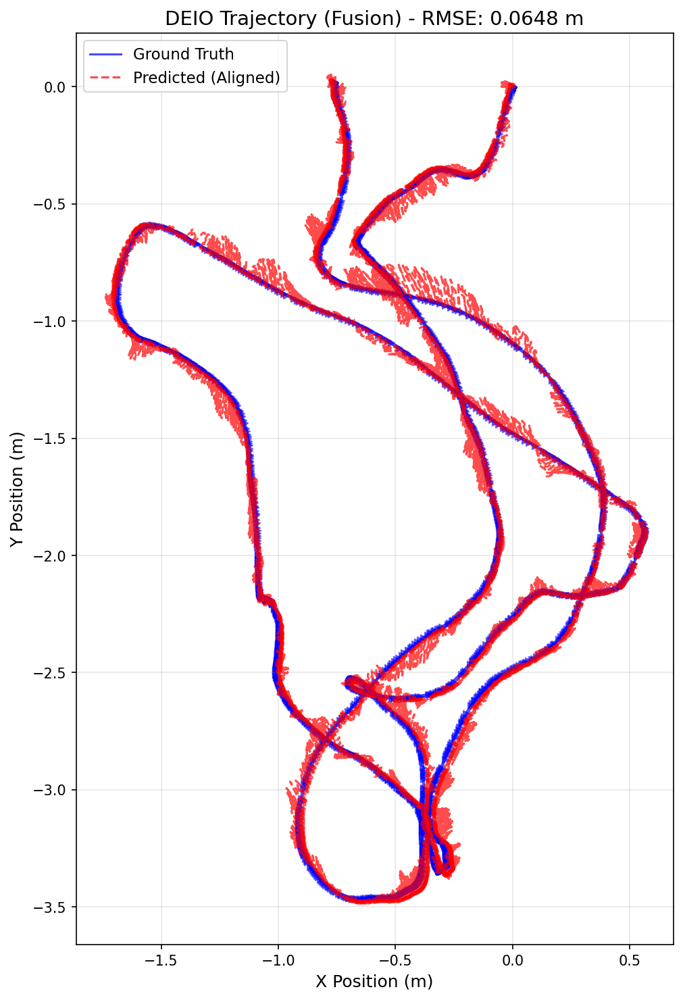

# MODEL USED: monocular ebc with calib file and using sensor fusion with imu data

# TRAINING LOG:

Starting DEIO training on cuda
Total training sequences: 6210
Checkpoints will be saved to: ./checkpoints
Epoch 1/30: 100%|██████████████████████████| 1552/1552 [01:56<00:00, 13.35it/s, event=9.78e-7, imu=0.00294, loss=0.003]
Epoch 1 Average Loss: 0.00300069
Epoch 2/30: 100%|███████████████████████| 1552/1552 [01:56<00:00, 13.34it/s, event=2.96e-7, imu=0.000892, loss=0.00171]
Epoch 2 Average Loss: 0.00171072
Epoch 3/30: 100%|████████████████████████| 1552/1552 [01:56<00:00, 13.30it/s, event=1.57e-7, imu=0.00114, loss=0.00106]
Epoch 3 Average Loss: 0.00105970
Epoch 4/30: 100%|██████████████████████| 1552/1552 [01:57<00:00, 13.24it/s, event=1.89e-7, imu=0.000442, loss=0.000798]
Epoch 4 Average Loss: 0.00079736
Epoch 5/30: 100%|███████████████████████| 1552/1552 [01:57<00:00, 13.24it/s, event=3.68e-8, imu=0.000258, loss=0.00069]
Epoch 5 Average Loss: 0.00068962
SAVED checkpoint: ./checkpoints/deio_model_ep5.pth
Epoch 6/30: 100%|██████████████████████| 1552/1552 [01:57<00:00, 13.23it/s, event=7.48e-8, imu=0.000427, loss=0.000577]
Epoch 6 Average Loss: 0.00057668
Epoch 7/30: 100%|███████████████████████| 1552/1552 [01:57<00:00, 13.20it/s, event=3.7e-8, imu=0.000545, loss=0.000519]
Epoch 7 Average Loss: 0.00051897
Epoch 8/30: 100%|██████████████████████| 1552/1552 [01:57<00:00, 13.19it/s, event=6.41e-9, imu=0.000246, loss=0.000433]
Epoch 8 Average Loss: 0.00043253
Epoch 9/30: 100%|███████████████████████| 1552/1552 [01:57<00:00, 13.23it/s, event=2.68e-9, imu=0.000304, loss=0.00039]
Epoch 9 Average Loss: 0.00038989
Epoch 10/30: 100%|███████████████████████| 1552/1552 [01:57<00:00, 13.19it/s, event=2.9e-8, imu=0.000225, loss=0.00035]
Epoch 10 Average Loss: 0.00035013
SAVED checkpoint: ./checkpoints/deio_model_ep10.pth
Epoch 11/30: 100%|█████████████████████| 1552/1552 [01:57<00:00, 13.19it/s, event=5.31e-8, imu=0.000714, loss=0.000294]
Epoch 11 Average Loss: 0.00029419
Epoch 12/30: 100%|███████████████████████| 1552/1552 [01:57<00:00, 13.22it/s, event=1.68e-9, imu=6.7e-5, loss=0.000274]
Epoch 12 Average Loss: 0.00027435
Epoch 13/30: 100%|█████████████████████| 1552/1552 [01:57<00:00, 13.26it/s, event=2.39e-9, imu=0.000166, loss=0.000256]
Epoch 13 Average Loss: 0.00025624
Epoch 14/30: 100%|████████████████████| 1552/1552 [01:57<00:00, 13.17it/s, event=6.52e-10, imu=0.000246, loss=0.000245]
Epoch 14 Average Loss: 0.00024482
Epoch 15/30: 100%|██████████████████████| 1552/1552 [01:57<00:00, 13.21it/s, event=9.76e-9, imu=0.000131, loss=0.00021]
Epoch 15 Average Loss: 0.00020987
SAVED checkpoint: ./checkpoints/deio_model_ep15.pth
Epoch 16/30: 100%|█████████████████████| 1552/1552 [01:57<00:00, 13.19it/s, event=2.17e-8, imu=0.000122, loss=0.000201]
Epoch 16 Average Loss: 0.00020044
Epoch 17/30: 100%|██████████████████████| 1552/1552 [01:57<00:00, 13.18it/s, event=7.28e-9, imu=0.00014, loss=0.000191]
Epoch 17 Average Loss: 0.00019071
Epoch 18/30: 100%|██████████████████████| 1552/1552 [01:58<00:00, 13.15it/s, event=4.27e-8, imu=7.16e-5, loss=0.000174]
Epoch 18 Average Loss: 0.00017438
Epoch 19/30: 100%|██████████████████████| 1552/1552 [01:57<00:00, 13.17it/s, event=1.72e-9, imu=8.38e-5, loss=0.000172]
Epoch 19 Average Loss: 0.00017153
Epoch 20/30: 100%|█████████████████████| 1552/1552 [01:58<00:00, 13.15it/s, event=1.77e-8, imu=0.000124, loss=0.000155]
Epoch 20 Average Loss: 0.00015546
SAVED checkpoint: ./checkpoints/deio_model_ep20.pth
Epoch 21/30: 100%|██████████████████████| 1552/1552 [01:57<00:00, 13.17it/s, event=2.75e-9, imu=0.000149, loss=0.00017]
Epoch 21 Average Loss: 0.00016946
Epoch 22/30: 100%|██████████████████████| 1552/1552 [01:58<00:00, 13.15it/s, event=4.24e-8, imu=3.66e-5, loss=0.000135]
Epoch 22 Average Loss: 0.00013465
Epoch 23/30: 100%|██████████████████████| 1552/1552 [01:57<00:00, 13.19it/s, event=1.95e-9, imu=7.75e-5, loss=0.000148]
Epoch 23 Average Loss: 0.00014790
Epoch 24/30: 100%|█████████████████████| 1552/1552 [01:57<00:00, 13.20it/s, event=3.25e-9, imu=0.000103, loss=0.000128]
Epoch 24 Average Loss: 0.00012742
Epoch 25/30: 100%|█████████████████████| 1552/1552 [01:58<00:00, 13.15it/s, event=2.17e-8, imu=0.000145, loss=0.000129]
Epoch 25 Average Loss: 0.00012879
SAVED checkpoint: ./checkpoints/deio_model_ep25.pth
Epoch 26/30: 100%|██████████████████████| 1552/1552 [01:58<00:00, 13.13it/s, event=1.67e-8, imu=7.41e-5, loss=0.000123]
Epoch 26 Average Loss: 0.00012317
Epoch 27/30: 100%|██████████████████████| 1552/1552 [01:57<00:00, 13.17it/s, event=1.8e-9, imu=0.000172, loss=0.000112]
Epoch 27 Average Loss: 0.00011241
Epoch 28/30: 100%|██████████████████████| 1552/1552 [01:58<00:00, 13.14it/s, event=2.43e-9, imu=0.000114, loss=0.00011]
Epoch 28 Average Loss: 0.00011038
Epoch 29/30: 100%|█████████████████████| 1552/1552 [01:57<00:00, 13.19it/s, event=1.04e-7, imu=0.000118, loss=0.000107]
Epoch 29 Average Loss: 0.00010731
Epoch 30/30: 100%|██████████████████████| 1552/1552 [01:57<00:00, 13.16it/s, event=9.82e-9, imu=4.93e-5, loss=0.000103]
Epoch 30 Average Loss: 0.00010248
SAVED checkpoint: ./checkpoints/deio_model_ep30.pth

# EVALUATION:

--- Starting Evaluation ---
Mode: MONO | CALIBRATED
IMU Input: ENABLED
DEIO Model loaded from ./checkpoints/deio_model_ep30.pth. Channels: 5
Running inference and state estimation...
100%|██████████████████████████████████████████████████████████████████████████████| 2196/2196 [01:17<00:00, 28.51it/s]
Aligning trajectories...

--- DEIO Evaluation Metrics ---
Total Trajectory Steps: 21960 steps
(21960, 3)
Sim(3) Scale Factor: 1.0035
Trajectory RMSE (ALIGNED): 0.0648 meters

Generating plot...
GT shape: (21960, 3), min: [-1.6873883 -3.4663277 -0.8056722], max: [0.5656026  0.02039042 3.62572   ]
Pred aligned shape: (21960, 3), min: [-1.7474128  -3.4839096  -0.84795797], max: [0.56966513 0.05158164 3.6427114 ]
Plot saved to deio_trajectory_comparison_aligned.png

