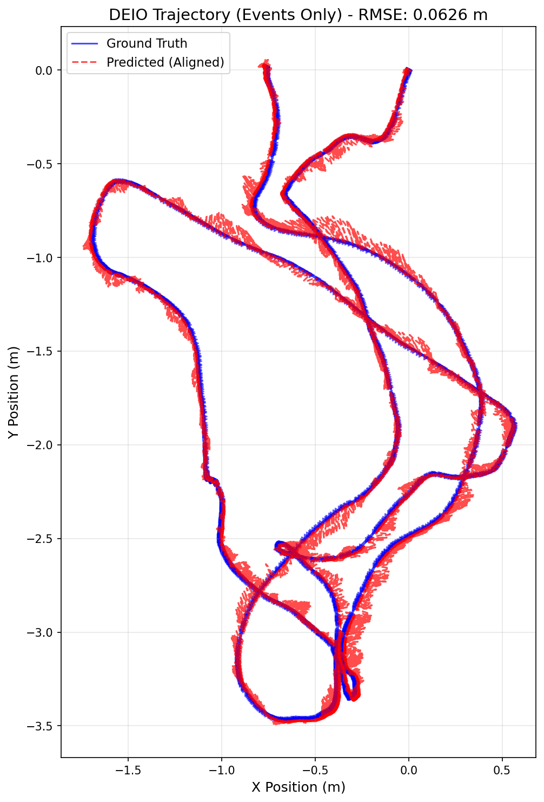

# MODEL USED: monocular ebc with calib file and WITHOUT using sensor fusion with imu data

# TRAINING LOG:

Starting DEIO training on cuda
Total training sequences: 6210
Checkpoints will be saved to: ./checkpoints
Epoch 1/30: 100%|████████████████████████| 1552/1552 [02:00<00:00, 12.83it/s, event=3.23e-7, imu=0.00327, loss=0.00299]
Epoch 1 Average Loss: 0.00299238
Epoch 2/30: 100%|███████████████████████| 1552/1552 [01:58<00:00, 13.13it/s, event=8.99e-8, imu=0.000352, loss=0.00169]
Epoch 2 Average Loss: 0.00169395
Epoch 3/30: 100%|████████████████████████| 1552/1552 [02:06<00:00, 12.28it/s, event=3.04e-8, imu=0.00154, loss=0.00106]
Epoch 3 Average Loss: 0.00106094
Epoch 4/30: 100%|██████████████████████| 1552/1552 [02:03<00:00, 12.58it/s, event=1.73e-8, imu=0.000261, loss=0.000825]
Epoch 4 Average Loss: 0.00082505
Epoch 5/30: 100%|███████████████████████| 1552/1552 [02:11<00:00, 11.80it/s, event=1.3e-8, imu=0.000519, loss=0.000689]
Epoch 5 Average Loss: 0.00068864
SAVED checkpoint: ./checkpoints/deio_model_ep5.pth
Epoch 6/30: 100%|███████████████████████| 1552/1552 [01:55<00:00, 13.46it/s, event=3.96e-9, imu=0.00101, loss=0.000603]
Epoch 6 Average Loss: 0.00060307
Epoch 7/30: 100%|██████████████████████| 1552/1552 [01:55<00:00, 13.40it/s, event=8.82e-8, imu=0.000172, loss=0.000538]
Epoch 7 Average Loss: 0.00053846
Epoch 8/30: 100%|███████████████████████| 1552/1552 [01:57<00:00, 13.17it/s, event=4.29e-9, imu=0.000607, loss=0.00048]
Epoch 8 Average Loss: 0.00048029
Epoch 9/30: 100%|███████████████████████| 1552/1552 [01:55<00:00, 13.43it/s, event=3.4e-9, imu=0.000533, loss=0.000434]
Epoch 9 Average Loss: 0.00043381
Epoch 10/30: 100%|██████████████████████| 1552/1552 [01:55<00:00, 13.41it/s, event=4.8e-9, imu=0.000245, loss=0.000359]
Epoch 10 Average Loss: 0.00035874
SAVED checkpoint: ./checkpoints/deio_model_ep10.pth
Epoch 11/30: 100%|█████████████████████| 1552/1552 [01:55<00:00, 13.46it/s, event=1.47e-8, imu=0.000263, loss=0.000338]
Epoch 11 Average Loss: 0.00033807
Epoch 12/30: 100%|█████████████████████| 1552/1552 [01:55<00:00, 13.43it/s, event=3.15e-8, imu=0.000379, loss=0.000316]
Epoch 12 Average Loss: 0.00031616
Epoch 13/30: 100%|██████████████████████| 1552/1552 [01:55<00:00, 13.41it/s, event=6.25e-9, imu=0.00017, loss=0.000285]
Epoch 13 Average Loss: 0.00028462
Epoch 14/30: 100%|██████████████████████| 1552/1552 [01:55<00:00, 13.46it/s, event=1.11e-7, imu=0.00222, loss=0.000258]
Epoch 14 Average Loss: 0.00025849
Epoch 15/30: 100%|████████████████████| 1552/1552 [01:55<00:00, 13.44it/s, event=1.86e-10, imu=0.000222, loss=0.000247]
Epoch 15 Average Loss: 0.00024660
SAVED checkpoint: ./checkpoints/deio_model_ep15.pth
Epoch 16/30: 100%|█████████████████████| 1552/1552 [01:55<00:00, 13.39it/s, event=5.1e-11, imu=0.000212, loss=0.000231]
Epoch 16 Average Loss: 0.00023055
Epoch 17/30: 100%|██████████████████████| 1552/1552 [01:55<00:00, 13.42it/s, event=4.42e-9, imu=7.14e-5, loss=0.000216]
Epoch 17 Average Loss: 0.00021578
Epoch 18/30: 100%|██████████████████████| 1552/1552 [01:55<00:00, 13.42it/s, event=2.32e-8, imu=6.11e-5, loss=0.000188]
Epoch 18 Average Loss: 0.00018773
Epoch 19/30: 100%|██████████████████████| 1552/1552 [02:02<00:00, 12.65it/s, event=6.69e-8, imu=7.51e-5, loss=0.000189]
Epoch 19 Average Loss: 0.00018870
Epoch 20/30: 100%|██████████████████████| 1552/1552 [01:58<00:00, 13.11it/s, event=7.43e-9, imu=8.34e-5, loss=0.000169]
Epoch 20 Average Loss: 0.00016869
SAVED checkpoint: ./checkpoints/deio_model_ep20.pth
Epoch 21/30: 100%|██████████████████████| 1552/1552 [01:59<00:00, 13.00it/s, event=4.21e-8, imu=7.19e-5, loss=0.000181]
Epoch 21 Average Loss: 0.00018054
Epoch 22/30: 100%|██████████████████████| 1552/1552 [01:58<00:00, 13.06it/s, event=1.24e-7, imu=0.00011, loss=0.000185]
Epoch 22 Average Loss: 0.00018486
Epoch 23/30: 100%|█████████████████████| 1552/1552 [01:59<00:00, 13.01it/s, event=6.36e-8, imu=0.000101, loss=0.000181]
Epoch 23 Average Loss: 0.00018148
Epoch 24/30: 100%|██████████████████████| 1552/1552 [01:58<00:00, 13.08it/s, event=4.26e-9, imu=8.61e-5, loss=0.000151]
Epoch 24 Average Loss: 0.00015056
Epoch 25/30: 100%|█████████████████████| 1552/1552 [01:58<00:00, 13.04it/s, event=3.08e-9, imu=0.000115, loss=0.000136]
Epoch 25 Average Loss: 0.00013624
SAVED checkpoint: ./checkpoints/deio_model_ep25.pth
Epoch 26/30: 100%|█████████████████████| 1552/1552 [01:59<00:00, 13.04it/s, event=5.13e-9, imu=0.000163, loss=0.000133]
Epoch 26 Average Loss: 0.00013337
Epoch 27/30: 100%|██████████████████████| 1552/1552 [01:58<00:00, 13.07it/s, event=9.52e-8, imu=6.82e-5, loss=0.000148]
Epoch 27 Average Loss: 0.00014811
Epoch 28/30: 100%|██████████████████████| 1552/1552 [01:59<00:00, 13.02it/s, event=7.13e-9, imu=6.02e-5, loss=0.000121]
Epoch 28 Average Loss: 0.00012074
Epoch 29/30: 100%|██████████████████████| 1552/1552 [02:00<00:00, 12.93it/s, event=2.04e-8, imu=6.59e-5, loss=0.000115]
Epoch 29 Average Loss: 0.00011484
Epoch 30/30: 100%|█████████████████████| 1552/1552 [01:59<00:00, 13.01it/s, event=8.26e-9, imu=0.000111, loss=0.000122]
Epoch 30 Average Loss: 0.00012241
SAVED checkpoint: ./checkpoints/deio_model_ep30.pth

# EVALUATION:

--- Starting Evaluation ---
Mode: MONO | CALIBRATED
IMU Input: DISABLED (Events-Only)
DEIO Model loaded from ./checkpoints/Mono_Calib_noIMU.pth. Channels: 5
Running inference and state estimation...
100%|██████████████████████████████████████████████████████████████████████████████| 2196/2196 [01:12<00:00, 30.27it/s]
Aligning trajectories...

--- DEIO Evaluation Metrics ---
Total Trajectory Steps: 21960 steps
(21960, 3)
Sim(3) Scale Factor: 1.0026
Trajectory RMSE (ALIGNED): 0.0626 meters

Generating plot...
GT shape: (21960, 3), min: [-1.6873883 -3.4663277 -0.8056722], max: [0.5656026  0.02039042 3.62572   ]
Pred aligned shape: (21960, 3), min: [-1.7446946 -3.4923503 -0.826252 ], max: [0.56419164 0.0549372  3.6498067 ]
Plot saved to deio_trajectory_comparison_aligned.png

