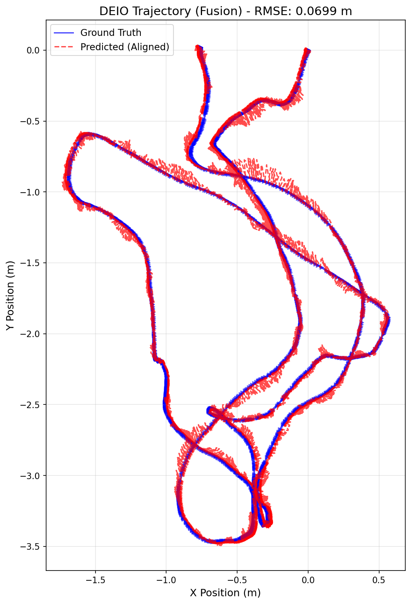

# MODEL USED: monocular ebc WITHOUT calib file and using sensor fusion with imu data

# TRAINING LOG:

Starting DEIO training on cuda
Total training sequences: 6210
Checkpoints will be saved to: ./checkpoints
Epoch 1/30: 100%|█████████████████████████| 1552/1552 [01:57<00:00, 13.26it/s, event=5.9e-7, imu=0.00309, loss=0.00332]
Epoch 1 Average Loss: 0.00331874
Epoch 2/30: 100%|██████████████████| 1552/1552 [02:05<00:00, 12.34it/s, event=2.27e-7, imu=0.00531, loss=0.00196]
Epoch 2 Average Loss: 0.00196274
Epoch 3/30: 100%|██████████████████| 1552/1552 [02:02<00:00, 12.66it/s, event=1.12e-7, imu=0.00126, loss=0.00121]
Epoch 3 Average Loss: 0.00121179
Epoch 4/30: 100%|████████████████| 1552/1552 [02:06<00:00, 12.27it/s, event=1.14e-7, imu=0.000978, loss=0.000893]
Epoch 4 Average Loss: 0.00089287
Epoch 5/30: 100%|█████████████████| 1552/1552 [01:58<00:00, 13.07it/s, event=9.24e-8, imu=0.00267, loss=0.000719]
Epoch 5 Average Loss: 0.00071931
SAVED checkpoint: ./checkpoints/deio_model_ep5.pth
Epoch 6/30: 100%|████████████████████| 1552/1552 [01:58<00:00, 13.06it/s, event=2e-7, imu=0.00204, loss=0.000633]
Epoch 6 Average Loss: 0.00063254
Epoch 7/30: 100%|████████████████| 1552/1552 [01:58<00:00, 13.05it/s, event=8.15e-8, imu=0.000341, loss=0.000542]
Epoch 7 Average Loss: 0.00054223
Epoch 8/30: 100%|█████████████████| 1552/1552 [01:59<00:00, 12.96it/s, event=1.9e-7, imu=0.000559, loss=0.000495]
Epoch 8 Average Loss: 0.00049494
Epoch 9/30: 100%|█████████████████| 1552/1552 [02:01<00:00, 12.81it/s, event=1.3e-8, imu=0.000609, loss=0.000425]
Epoch 9 Average Loss: 0.00042452
Epoch 10/30: 100%|████████████████| 1552/1552 [02:02<00:00, 12.64it/s, event=1.18e-7, imu=0.00084, loss=0.000367]
Epoch 10 Average Loss: 0.00036685
SAVED checkpoint: ./checkpoints/deio_model_ep10.pth
Epoch 11/30: 100%|███████████████| 1552/1552 [01:58<00:00, 13.07it/s, event=9.22e-8, imu=0.000214, loss=0.000332]
Epoch 11 Average Loss: 0.00033142
Epoch 12/30: 100%|███████████████| 1552/1552 [01:59<00:00, 13.00it/s, event=1.65e-8, imu=0.000263, loss=0.000293]
Epoch 12 Average Loss: 0.00029330
Epoch 13/30: 100%|█████████████████| 1552/1552 [01:58<00:00, 13.04it/s, event=1.7e-8, imu=0.00024, loss=0.000258]
Epoch 13 Average Loss: 0.00025832
Epoch 14/30: 100%|███████████████| 1552/1552 [01:59<00:00, 13.01it/s, event=2.42e-9, imu=0.000482, loss=0.000242]
Epoch 14 Average Loss: 0.00024185
Epoch 15/30: 100%|███████████████| 1552/1552 [01:59<00:00, 12.97it/s, event=3.72e-8, imu=0.000246, loss=0.000221]
Epoch 15 Average Loss: 0.00022058
SAVED checkpoint: ./checkpoints/deio_model_ep15.pth
Epoch 16/30: 100%|███████████████| 1552/1552 [02:03<00:00, 12.53it/s, event=1.66e-9, imu=0.000146, loss=0.000206]
Epoch 16 Average Loss: 0.00020580
Epoch 17/30: 100%|███████████████| 1552/1552 [02:09<00:00, 11.95it/s, event=6.86e-9, imu=0.000163, loss=0.000202]
Epoch 17 Average Loss: 0.00020156
Epoch 18/30: 100%|███████████████| 1552/1552 [02:07<00:00, 12.15it/s, event=8.02e-9, imu=0.000174, loss=0.000175]
Epoch 18 Average Loss: 0.00017458
Epoch 19/30: 100%|██████████████| 1552/1552 [01:57<00:00, 13.18it/s, event=5.26e-10, imu=0.000115, loss=0.000169]
Epoch 19 Average Loss: 0.00016874
Epoch 20/30: 100%|███████████████| 1552/1552 [01:57<00:00, 13.15it/s, event=3.08e-9, imu=0.000417, loss=0.000186]
Epoch 20 Average Loss: 0.00018598
SAVED checkpoint: ./checkpoints/deio_model_ep20.pth
Epoch 21/30: 100%|██████████████| 1552/1552 [01:57<00:00, 13.16it/s, event=9.62e-10, imu=0.000194, loss=0.000153]
Epoch 21 Average Loss: 0.00015300
Epoch 22/30: 100%|███████████████| 1552/1552 [01:57<00:00, 13.17it/s, event=4.42e-8, imu=0.000179, loss=0.000138]
Epoch 22 Average Loss: 0.00013812
Epoch 23/30: 100%|████████████████| 1552/1552 [02:00<00:00, 12.90it/s, event=6.85e-9, imu=9.28e-5, loss=0.000137]
Epoch 23 Average Loss: 0.00013716
Epoch 24/30: 100%|████████████████| 1552/1552 [01:57<00:00, 13.19it/s, event=2.77e-9, imu=7.65e-5, loss=0.000139]
Epoch 24 Average Loss: 0.00013874
Epoch 25/30: 100%|████████████████| 1552/1552 [01:58<00:00, 13.15it/s, event=1.57e-8, imu=0.000116, loss=0.00014]
Epoch 25 Average Loss: 0.00013997
SAVED checkpoint: ./checkpoints/deio_model_ep25.pth
Epoch 26/30: 100%|██████████████████| 1552/1552 [02:00<00:00, 12.87it/s, event=1e-9, imu=0.000134, loss=0.000116]
Epoch 26 Average Loss: 0.00011553
Epoch 27/30: 100%|█████████████████| 1552/1552 [01:58<00:00, 13.05it/s, event=3.12e-9, imu=8.69e-5, loss=0.00012]
Epoch 27 Average Loss: 0.00012049
Epoch 28/30: 100%|███████████████| 1552/1552 [01:59<00:00, 13.01it/s, event=7.3e-10, imu=0.000174, loss=0.000118]
Epoch 28 Average Loss: 0.00011834
Epoch 29/30: 100%|███████████████| 1552/1552 [01:58<00:00, 13.05it/s, event=7.38e-10, imu=5.06e-5, loss=0.000104]
Epoch 29 Average Loss: 0.00010435
Epoch 30/30: 100%|███████████████| 1552/1552 [01:58<00:00, 13.05it/s, event=2.58e-8, imu=0.000713, loss=0.000106]
Epoch 30 Average Loss: 0.00010606
SAVED checkpoint: ./checkpoints/deio_model_ep30.pth

# EVALUATION:

--- Starting Evaluation ---
Mode: MONO | UNCALIBRATED
IMU Input: ENABLED
DEIO Model loaded from ./checkpoints/mono_noCalib_IMU.pth. Channels: 5
Running inference and state estimation...
100%|██████████████████████████████████████████████████████████████████████████████| 2196/2196 [01:14<00:00, 29.62it/s]
Aligning trajectories...

--- DEIO Evaluation Metrics ---
Total Trajectory Steps: 21960 steps
(21960, 3)
Sim(3) Scale Factor: 1.0021
Trajectory RMSE (ALIGNED): 0.0699 meters

Generating plot...
GT shape: (21960, 3), min: [-1.6873883 -3.4663277 -0.8056722], max: [0.5656026  0.02039042 3.62572   ]
Pred aligned shape: (21960, 3), min: [-1.7335948 -3.4940002 -0.8453279], max: [0.5699397  0.03593785 3.6662502 ]
Plot saved to deio_trajectory_comparison_aligned.png

