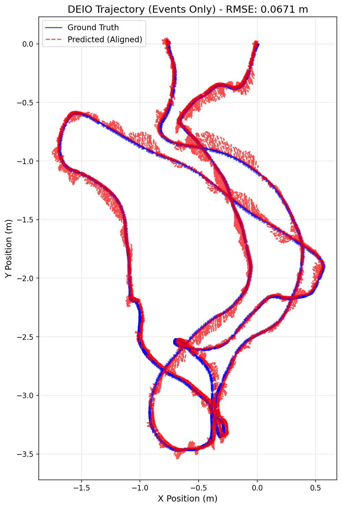

# MODEL USED: monocular ebc WITHOUT calib file and WITHOUT using sensor fusion with imu data

# TRAINING LOG:

Starting DEIO training on cuda
Total training sequences: 6210
Checkpoints will be saved to: ./checkpoints
Epoch 1/30: 100%|████████████████████████| 1552/1552 [01:56<00:00, 13.32it/s, event=8.36e-8, imu=0.00149, loss=0.00306]
Epoch 1 Average Loss: 0.00305916
Epoch 2/30: 100%|███████████████████████| 1552/1552 [01:57<00:00, 13.23it/s, event=4.11e-8, imu=0.000463, loss=0.00177]
Epoch 2 Average Loss: 0.00176870
Epoch 3/30: 100%|████████████████████████| 1552/1552 [01:57<00:00, 13.21it/s, event=1.15e-8, imu=0.000655, loss=0.0011]
Epoch 3 Average Loss: 0.00109924
Epoch 4/30: 100%|██████████████████████| 1552/1552 [01:57<00:00, 13.21it/s, event=1.19e-8, imu=0.000359, loss=0.000813]
Epoch 4 Average Loss: 0.00081285
Epoch 5/30: 100%|███████████████████████| 1552/1552 [01:58<00:00, 13.15it/s, event=5.35e-8, imu=0.00081, loss=0.000686]
Epoch 5 Average Loss: 0.00068523
SAVED checkpoint: ./checkpoints/deio_model_ep5.pth
Epoch 6/30: 100%|██████████████████████| 1552/1552 [01:57<00:00, 13.18it/s, event=1.92e-9, imu=0.000949, loss=0.000576]
Epoch 6 Average Loss: 0.00057604
Epoch 7/30: 100%|██████████████████████| 1552/1552 [01:57<00:00, 13.17it/s, event=2.63e-8, imu=0.000181, loss=0.000496]
Epoch 7 Average Loss: 0.00049554
Epoch 8/30: 100%|██████████████████████| 1552/1552 [01:57<00:00, 13.21it/s, event=6.57e-9, imu=0.000405, loss=0.000432]
Epoch 8 Average Loss: 0.00043142
Epoch 9/30: 100%|██████████████████████| 1552/1552 [01:57<00:00, 13.19it/s, event=3.27e-9, imu=0.000248, loss=0.000364]
Epoch 9 Average Loss: 0.00036350
Epoch 10/30: 100%|█████████████████████| 1552/1552 [01:57<00:00, 13.18it/s, event=2.69e-9, imu=0.000253, loss=0.000332]
Epoch 10 Average Loss: 0.00033220
SAVED checkpoint: ./checkpoints/deio_model_ep10.pth
Epoch 11/30: 100%|█████████████████████| 1552/1552 [01:57<00:00, 13.19it/s, event=1.52e-8, imu=0.000357, loss=0.000291]
Epoch 11 Average Loss: 0.00029108
Epoch 12/30: 100%|██████████████████████| 1552/1552 [01:57<00:00, 13.17it/s, event=9.93e-9, imu=0.00117, loss=0.000259]
Epoch 12 Average Loss: 0.00025851
Epoch 13/30: 100%|█████████████████████| 1552/1552 [01:57<00:00, 13.19it/s, event=3.66e-8, imu=0.000151, loss=0.000241]
Epoch 13 Average Loss: 0.00024083
Epoch 14/30: 100%|██████████████████████| 1552/1552 [01:57<00:00, 13.20it/s, event=2.97e-8, imu=7.09e-5, loss=0.000212]
Epoch 14 Average Loss: 0.00021208
Epoch 15/30: 100%|██████████████████████| 1552/1552 [01:57<00:00, 13.18it/s, event=1.1e-8, imu=0.000215, loss=0.000191]
Epoch 15 Average Loss: 0.00019082
SAVED checkpoint: ./checkpoints/deio_model_ep15.pth
Epoch 16/30: 100%|█████████████████████| 1552/1552 [01:57<00:00, 13.18it/s, event=6.96e-9, imu=0.000142, loss=0.000199]
Epoch 16 Average Loss: 0.00019873
Epoch 17/30: 100%|█████████████████████| 1552/1552 [01:57<00:00, 13.17it/s, event=2.69e-9, imu=0.000213, loss=0.000197]
Epoch 17 Average Loss: 0.00019691
Epoch 18/30: 100%|██████████████████████| 1552/1552 [01:57<00:00, 13.19it/s, event=3.32e-8, imu=8.77e-5, loss=0.000167]
Epoch 18 Average Loss: 0.00016664
Epoch 19/30: 100%|████████████████████| 1552/1552 [01:57<00:00, 13.20it/s, event=2.46e-10, imu=0.000137, loss=0.000159]
Epoch 19 Average Loss: 0.00015899
Epoch 20/30: 100%|██████████████████████| 1552/1552 [01:57<00:00, 13.16it/s, event=7.48e-10, imu=6.97e-5, loss=0.00018]
Epoch 20 Average Loss: 0.00018044
SAVED checkpoint: ./checkpoints/deio_model_ep20.pth
Epoch 21/30: 100%|██████████████████████| 1552/1552 [01:58<00:00, 13.14it/s, event=9.53e-8, imu=5.63e-5, loss=0.000132]
Epoch 21 Average Loss: 0.00013151
Epoch 22/30: 100%|███████████████████████| 1552/1552 [01:57<00:00, 13.19it/s, event=6.09e-9, imu=7.6e-5, loss=0.000136]
Epoch 22 Average Loss: 0.00013624
Epoch 23/30: 100%|█████████████████████| 1552/1552 [01:57<00:00, 13.21it/s, event=2.52e-9, imu=0.000146, loss=0.000169]
Epoch 23 Average Loss: 0.00016877
Epoch 24/30: 100%|██████████████████████| 1552/1552 [01:57<00:00, 13.18it/s, event=3.34e-9, imu=9.12e-5, loss=0.000128]
Epoch 24 Average Loss: 0.00012753
Epoch 25/30: 100%|██████████████████████| 1552/1552 [01:57<00:00, 13.22it/s, event=2.07e-9, imu=6.26e-5, loss=0.000117]
Epoch 25 Average Loss: 0.00011714
SAVED checkpoint: ./checkpoints/deio_model_ep25.pth
Epoch 26/30: 100%|████████████████████| 1552/1552 [01:57<00:00, 13.17it/s, event=8.11e-10, imu=0.000226, loss=0.000123]
Epoch 26 Average Loss: 0.00012285
Epoch 27/30: 100%|█████████████████████| 1552/1552 [01:57<00:00, 13.25it/s, event=2.12e-10, imu=0.000142, loss=0.00013]
Epoch 27 Average Loss: 0.00013047
Epoch 28/30: 100%|██████████████████████| 1552/1552 [01:57<00:00, 13.18it/s, event=3.41e-7, imu=0.000103, loss=0.00011]
Epoch 28 Average Loss: 0.00010967
Epoch 29/30: 100%|█████████████████████| 1552/1552 [01:57<00:00, 13.22it/s, event=8.38e-8, imu=0.000157, loss=0.000123]
Epoch 29 Average Loss: 0.00012329
Epoch 30/30: 100%|█████████████████████| 1552/1552 [01:57<00:00, 13.16it/s, event=2.32e-10, imu=8.46e-5, loss=0.000135]
Epoch 30 Average Loss: 0.00013527
SAVED checkpoint: ./checkpoints/deio_model_ep30.pth

# EVALUATION:

--- Starting Evaluation ---
Mode: MONO | UNCALIBRATED
IMU Input: DISABLED (Events-Only)
DEIO Model loaded from ./checkpoints/Mono_noCalib_noIMU.pth. Channels: 5
Running inference and state estimation...
100%|██████████████████████████████████████████████████████████████████████████████| 2196/2196 [01:16<00:00, 28.67it/s]
Aligning trajectories...

--- DEIO Evaluation Metrics ---
Total Trajectory Steps: 21960 steps
(21960, 3)
Sim(3) Scale Factor: 0.9988
Trajectory RMSE (ALIGNED): 0.0671 meters

Generating plot...
GT shape: (21960, 3), min: [-1.6873883 -3.4663277 -0.8056722], max: [0.5656026  0.02039042 3.62572   ]
Pred aligned shape: (21960, 3), min: [-1.7505401 -3.5414379 -0.8615361], max: [0.5640439  0.05055938 3.7034435 ]
Plot saved to deio_trajectory_comparison_aligned.png

