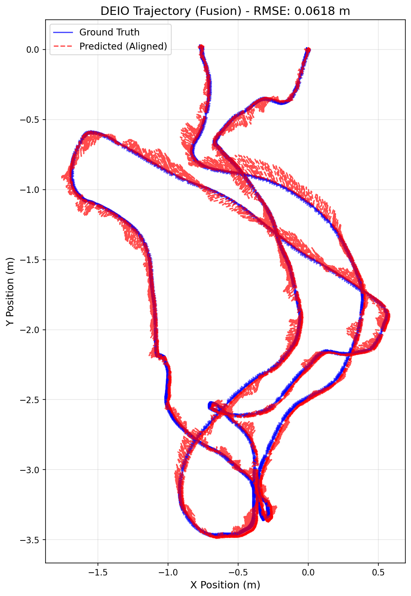

# MODEL USED: stereo ebc with calib file and using sensor fusion with imu data

# TRAINING LOG:

Starting DEIO training on cuda
Total training sequences: 6208
Checkpoints will be saved to: ./checkpoints
Epoch 1/30: 100%|████████████████████████| 1552/1552 [03:25<00:00,  7.55it/s, event=4.27e-7, imu=0.00403, loss=0.00307]
Epoch 1 Average Loss: 0.00306935
Epoch 2/30: 100%|███████████████████████| 1552/1552 [03:37<00:00,  7.14it/s, event=7.15e-8, imu=0.000722, loss=0.00162]
Epoch 2 Average Loss: 0.00162179
Epoch 3/30: 100%|███████████████████████| 1552/1552 [03:31<00:00,  7.33it/s, event=3.92e-8, imu=0.000306, loss=0.00104]
Epoch 3 Average Loss: 0.00103954
Epoch 4/30: 100%|██████████████████████| 1552/1552 [03:28<00:00,  7.46it/s, event=3.62e-8, imu=0.000447, loss=0.000791]
Epoch 4 Average Loss: 0.00079000
Epoch 5/30: 100%|██████████████████████| 1552/1552 [03:34<00:00,  7.22it/s, event=3.42e-8, imu=0.000461, loss=0.000674]
Epoch 5 Average Loss: 0.00067417
SAVED checkpoint: ./checkpoints/deio_model_ep5.pth
Epoch 6/30: 100%|███████████████████████| 1552/1552 [03:23<00:00,  7.62it/s, event=2.5e-8, imu=0.000394, loss=0.000579]
Epoch 6 Average Loss: 0.00057887
Epoch 7/30: 100%|██████████████████████| 1552/1552 [03:17<00:00,  7.86it/s, event=1.61e-8, imu=0.000794, loss=0.000502]
Epoch 7 Average Loss: 0.00050196
Epoch 8/30: 100%|██████████████████████| 1552/1552 [03:48<00:00,  6.79it/s, event=1.28e-9, imu=0.000165, loss=0.000451]
Epoch 8 Average Loss: 0.00045138
Epoch 9/30: 100%|██████████████████████| 1552/1552 [03:28<00:00,  7.44it/s, event=2.87e-7, imu=0.000653, loss=0.000393]
Epoch 9 Average Loss: 0.00039293
Epoch 10/30: 100%|█████████████████████| 1552/1552 [03:21<00:00,  7.69it/s, event=1.08e-7, imu=0.000175, loss=0.000358]
Epoch 10 Average Loss: 0.00035845
SAVED checkpoint: ./checkpoints/deio_model_ep10.pth
Epoch 11/30: 100%|████████████████████| 1552/1552 [03:17<00:00,  7.86it/s, event=9.56e-10, imu=0.000228, loss=0.000322]
Epoch 11 Average Loss: 0.00032194
Epoch 12/30: 100%|██████████████████████| 1552/1552 [03:18<00:00,  7.82it/s, event=1.5e-8, imu=0.000145, loss=0.000287]
Epoch 12 Average Loss: 0.00028724
Epoch 13/30: 100%|██████████████████████| 1552/1552 [03:20<00:00,  7.72it/s, event=6.4e-9, imu=0.000242, loss=0.000271]
Epoch 13 Average Loss: 0.00027078
Epoch 14/30: 100%|██████████████████████| 1552/1552 [03:19<00:00,  7.77it/s, event=1.71e-9, imu=7.32e-5, loss=0.000241]
Epoch 14 Average Loss: 0.00024107
Epoch 15/30: 100%|█████████████████████| 1552/1552 [03:20<00:00,  7.76it/s, event=2.02e-8, imu=0.000136, loss=0.000225]
Epoch 15 Average Loss: 0.00022463
SAVED checkpoint: ./checkpoints/deio_model_ep15.pth
Epoch 16/30: 100%|█████████████████████| 1552/1552 [03:21<00:00,  7.72it/s, event=7.53e-8, imu=0.000158, loss=0.000213]
Epoch 16 Average Loss: 0.00021258
Epoch 17/30: 100%|███████████████████████| 1552/1552 [03:18<00:00,  7.80it/s, event=8.2e-8, imu=5.99e-5, loss=0.000188]
Epoch 17 Average Loss: 0.00018750
Epoch 18/30: 100%|███████████████████████| 1552/1552 [03:20<00:00,  7.74it/s, event=8e-10, imu=0.000325, loss=0.000176]
Epoch 18 Average Loss: 0.00017621
Epoch 19/30: 100%|█████████████████████| 1552/1552 [03:20<00:00,  7.73it/s, event=2.09e-7, imu=0.000154, loss=0.000178]
Epoch 19 Average Loss: 0.00017752
Epoch 20/30: 100%|██████████████████████| 1552/1552 [03:23<00:00,  7.63it/s, event=4.88e-9, imu=6.62e-5, loss=0.000158]
Epoch 20 Average Loss: 0.00015787
SAVED checkpoint: ./checkpoints/deio_model_ep20.pth
Epoch 21/30: 100%|██████████████████████| 1552/1552 [03:19<00:00,  7.80it/s, event=2.41e-7, imu=9.34e-5, loss=0.000159]
Epoch 21 Average Loss: 0.00015851
Epoch 22/30: 100%|██████████████████████| 1552/1552 [03:18<00:00,  7.83it/s, event=7.34e-9, imu=0.000113, loss=0.00015]
Epoch 22 Average Loss: 0.00014943
Epoch 23/30: 100%|██████████████████████| 1552/1552 [03:21<00:00,  7.70it/s, event=1.13e-9, imu=8.59e-5, loss=0.000134]
Epoch 23 Average Loss: 0.00013351
Epoch 24/30: 100%|██████████████████████| 1552/1552 [03:31<00:00,  7.34it/s, event=9.58e-10, imu=2.89e-5, loss=0.00013]
Epoch 24 Average Loss: 0.00012990
Epoch 25/30: 100%|█████████████████████| 1552/1552 [03:21<00:00,  7.70it/s, event=7.32e-9, imu=0.000131, loss=0.000128]
Epoch 25 Average Loss: 0.00012822
SAVED checkpoint: ./checkpoints/deio_model_ep25.pth
Epoch 26/30: 100%|██████████████████████| 1552/1552 [03:28<00:00,  7.46it/s, event=3.75e-9, imu=5.41e-5, loss=0.000124]
Epoch 26 Average Loss: 0.00012373
Epoch 27/30: 100%|██████████████████████| 1552/1552 [03:40<00:00,  7.04it/s, event=1.61e-7, imu=4.48e-5, loss=0.000133]
Epoch 27 Average Loss: 0.00013344
Epoch 28/30: 100%|██████████████████████| 1552/1552 [03:26<00:00,  7.51it/s, event=1.96e-8, imu=9.53e-5, loss=0.000127]
Epoch 28 Average Loss: 0.00012685
Epoch 29/30: 100%|███████████████████████| 1552/1552 [03:37<00:00,  7.12it/s, event=1.58e-9, imu=4.3e-5, loss=0.000103]
Epoch 29 Average Loss: 0.00010308
Epoch 30/30: 100%|███████████████████████| 1552/1552 [03:31<00:00,  7.34it/s, event=1.07e-8, imu=0.00013, loss=9.68e-5]
Epoch 30 Average Loss: 0.00009682
SAVED checkpoint: ./checkpoints/deio_model_ep30.pth

# EVALUATION:

--- Starting Evaluation ---
Mode: STEREO | CALIBRATED
IMU Input: ENABLED
DEIO Model loaded from ./checkpoints/deio_model_ep30.pth. Channels: 10
Running inference and state estimation...
100%|██████████████████████████████████████████████████████████████████████████████| 2196/2196 [01:57<00:00, 18.66it/s]
Aligning trajectories...

--- DEIO Evaluation Metrics ---
Total Trajectory Steps: 21960 steps
(21960, 3)
Sim(3) Scale Factor: 1.0040
Trajectory RMSE (ALIGNED): 0.0618 meters

Generating plot...
GT shape: (21960, 3), min: [-1.6873883 -3.4663277 -0.8056722], max: [0.5656026  0.02039042 3.62572   ]
Pred aligned shape: (21960, 3), min: [-1.7579635  -3.4895105  -0.83144706], max: [0.575624   0.03542783 3.648576  ]
Plot saved to deio_trajectory_comparison_aligned.png

