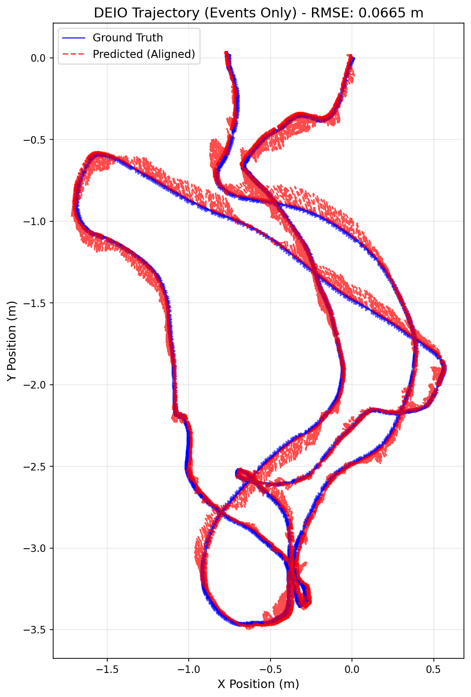

# MODEL USED: stereo ebc with calib file and WITHOUT using sensor fusion with imu data

# TRAINING LOG:

Starting DEIO training on cuda
Total training sequences: 6208
Checkpoints will be saved to: ./checkpoints
Epoch 1/30: 100%|████████████████████████| 1552/1552 [03:20<00:00,  7.76it/s, event=5.98e-7, imu=0.00128, loss=0.00375]
Epoch 1 Average Loss: 0.00374592
Epoch 2/30: 100%|█████████████████████████| 1552/1552 [03:19<00:00,  7.79it/s, event=1.3e-7, imu=0.00112, loss=0.00183]
Epoch 2 Average Loss: 0.00182774
Epoch 3/30: 100%|████████████████████████| 1552/1552 [03:18<00:00,  7.82it/s, event=2.7e-7, imu=0.000256, loss=0.00114]
Epoch 3 Average Loss: 0.00113576
Epoch 4/30: 100%|███████████████████████| 1552/1552 [03:19<00:00,  7.78it/s, event=8.51e-8, imu=0.000789, loss=0.00089]
Epoch 4 Average Loss: 0.00088977
Epoch 5/30: 100%|███████████████████████| 1552/1552 [03:14<00:00,  7.99it/s, event=2.16e-7, imu=0.000187, loss=0.00072]
Epoch 5 Average Loss: 0.00071971
SAVED checkpoint: ./checkpoints/deio_model_ep5.pth
Epoch 6/30: 100%|██████████████████████| 1552/1552 [03:16<00:00,  7.91it/s, event=1.15e-7, imu=0.000374, loss=0.000637]
Epoch 6 Average Loss: 0.00063703
Epoch 7/30: 100%|████████████████████████| 1552/1552 [03:16<00:00,  7.91it/s, event=1.3e-7, imu=0.00064, loss=0.000548]
Epoch 7 Average Loss: 0.00054801
Epoch 8/30: 100%|██████████████████████| 1552/1552 [03:16<00:00,  7.90it/s, event=9.02e-9, imu=0.000458, loss=0.000464]
Epoch 8 Average Loss: 0.00046433
Epoch 9/30: 100%|███████████████████████| 1552/1552 [03:16<00:00,  7.91it/s, event=3.95e-8, imu=0.000367, loss=0.00042]
Epoch 9 Average Loss: 0.00041973
Epoch 10/30: 100%|████████████████████████| 1552/1552 [03:15<00:00,  7.93it/s, event=2e-8, imu=0.000137, loss=0.000386]
Epoch 10 Average Loss: 0.00038637
SAVED checkpoint: ./checkpoints/deio_model_ep10.pth
Epoch 11/30: 100%|█████████████████████| 1552/1552 [03:17<00:00,  7.87it/s, event=1.57e-7, imu=0.000529, loss=0.000337]
Epoch 11 Average Loss: 0.00033706
Epoch 12/30: 100%|███████████████████████| 1552/1552 [03:17<00:00,  7.86it/s, event=3.71e-9, imu=0.000535, loss=0.0003]
Epoch 12 Average Loss: 0.00030008
Epoch 13/30: 100%|██████████████████████| 1552/1552 [03:16<00:00,  7.88it/s, event=8.6e-9, imu=0.000178, loss=0.000273]
Epoch 13 Average Loss: 0.00027278
Epoch 14/30: 100%|██████████████████████| 1552/1552 [03:16<00:00,  7.89it/s, event=1.3e-8, imu=0.000208, loss=0.000255]
Epoch 14 Average Loss: 0.00025502
Epoch 15/30: 100%|██████████████████████| 1552/1552 [03:15<00:00,  7.92it/s, event=4.49e-9, imu=2.51e-5, loss=0.000234]
Epoch 15 Average Loss: 0.00023337
SAVED checkpoint: ./checkpoints/deio_model_ep15.pth
Epoch 16/30: 100%|██████████████████████| 1552/1552 [03:17<00:00,  7.87it/s, event=1.84e-9, imu=9.99e-5, loss=0.000217]
Epoch 16 Average Loss: 0.00021687
Epoch 17/30: 100%|█████████████████████| 1552/1552 [03:15<00:00,  7.94it/s, event=2.47e-9, imu=0.000433, loss=0.000202]
Epoch 17 Average Loss: 0.00020182
Epoch 18/30: 100%|████████████████████| 1552/1552 [03:16<00:00,  7.88it/s, event=4.14e-10, imu=0.000219, loss=0.000189]
Epoch 18 Average Loss: 0.00018912
Epoch 19/30: 100%|█████████████████████| 1552/1552 [03:15<00:00,  7.94it/s, event=1.99e-9, imu=0.000184, loss=0.000172]
Epoch 19 Average Loss: 0.00017182
Epoch 20/30: 100%|█████████████████████| 1552/1552 [03:19<00:00,  7.80it/s, event=2.31e-7, imu=0.000285, loss=0.000169]
Epoch 20 Average Loss: 0.00016872
SAVED checkpoint: ./checkpoints/deio_model_ep20.pth
Epoch 21/30: 100%|██████████████████████| 1552/1552 [03:15<00:00,  7.95it/s, event=7.41e-9, imu=7.55e-5, loss=0.000156]
Epoch 21 Average Loss: 0.00015602
Epoch 22/30: 100%|█████████████████████| 1552/1552 [03:16<00:00,  7.91it/s, event=1.66e-9, imu=0.000108, loss=0.000151]
Epoch 22 Average Loss: 0.00015068
Epoch 23/30: 100%|█████████████████████| 1552/1552 [03:16<00:00,  7.90it/s, event=1.15e-9, imu=0.000121, loss=0.000142]
Epoch 23 Average Loss: 0.00014249
Epoch 24/30: 100%|█████████████████████| 1552/1552 [03:18<00:00,  7.84it/s, event=1.85e-7, imu=0.000127, loss=0.000134]
Epoch 24 Average Loss: 0.00013441
Epoch 25/30: 100%|█████████████████████| 1552/1552 [03:14<00:00,  7.96it/s, event=7.25e-9, imu=0.000109, loss=0.000128]
Epoch 25 Average Loss: 0.00012781
SAVED checkpoint: ./checkpoints/deio_model_ep25.pth
Epoch 26/30: 100%|██████████████████████| 1552/1552 [03:16<00:00,  7.92it/s, event=6.27e-9, imu=8.26e-5, loss=0.000116]
Epoch 26 Average Loss: 0.00011574
Epoch 27/30: 100%|█████████████████████| 1552/1552 [03:16<00:00,  7.91it/s, event=7.73e-9, imu=0.000184, loss=0.000113]
Epoch 27 Average Loss: 0.00011306
Epoch 28/30: 100%|█████████████████████| 1552/1552 [03:17<00:00,  7.87it/s, event=9.88e-10, imu=5.28e-5, loss=0.000125]
Epoch 28 Average Loss: 0.00012509
Epoch 29/30: 100%|█████████████████████| 1552/1552 [03:15<00:00,  7.92it/s, event=2.19e-10, imu=3.56e-5, loss=0.000105]
Epoch 29 Average Loss: 0.00010474
Epoch 30/30: 100%|██████████████████████| 1552/1552 [03:15<00:00,  7.94it/s, event=1.01e-9, imu=0.000139, loss=9.99e-5]
Epoch 30 Average Loss: 0.00009994
SAVED checkpoint: ./checkpoints/deio_model_ep30.pth

# EVALUATION:

--- Starting Evaluation ---
Mode: STEREO | CALIBRATED
IMU Input: DISABLED (Events-Only)
DEIO Model loaded from ./checkpoints/deio_model_ep30.pth. Channels: 10
Running inference and state estimation...
100%|██████████████████████████████████████████████████████████████████████████████| 2196/2196 [01:59<00:00, 18.40it/s]
Aligning trajectories...

--- DEIO Evaluation Metrics ---
Total Trajectory Steps: 21960 steps
(21960, 3)
Sim(3) Scale Factor: 1.0040
Trajectory RMSE (ALIGNED): 0.0665 meters

Generating plot...
GT shape: (21960, 3), min: [-1.6873883 -3.4663277 -0.8056722], max: [0.5656026  0.02039042 3.62572   ]
Pred aligned shape: (21960, 3), min: [-1.7179757 -3.4993267 -0.8161243], max: [0.57196397 0.03635751 3.6550097 ]
Plot saved to deio_trajectory_comparison_aligned.png

