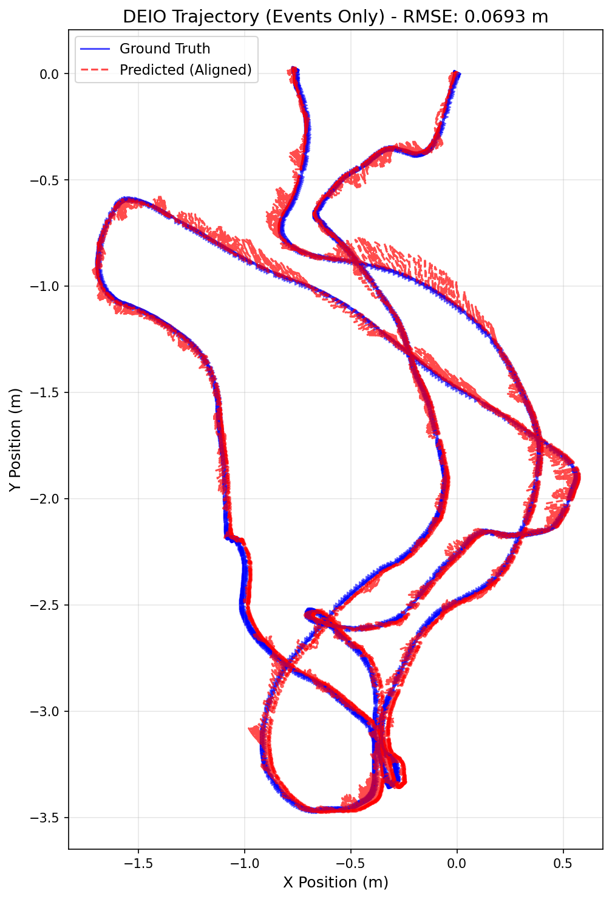

# MODEL USED: stereo ebc WITHOUT calib file and WITHOUT using sensor fusion with imu data

# TRAINING LOG:

Starting DEIO training on cuda
Total training sequences: 6210
Checkpoints will be saved to: ./checkpoints
Epoch 1/30: 100%|████████████████████████| 1552/1552 [04:30<00:00,  5.75it/s, event=1.91e-7, imu=0.00475, loss=0.00309]
Epoch 1 Average Loss: 0.00308558
Epoch 2/30: 100%|██████████████████| 1552/1552 [03:44<00:00,  6.91it/s, event=5.18e-8, imu=0.000876, loss=0.0018]
Epoch 2 Average Loss: 0.00180299
Epoch 3/30: 100%|██████████████████| 1552/1552 [03:59<00:00,  6.49it/s, event=1.14e-8, imu=0.00124, loss=0.00107]
Epoch 3 Average Loss: 0.00107007
Epoch 4/30: 100%|████████████████| 1552/1552 [03:48<00:00,  6.79it/s, event=3.69e-8, imu=0.000521, loss=0.000799]
Epoch 4 Average Loss: 0.00079854
Epoch 5/30: 100%|█████████████████| 1552/1552 [03:55<00:00,  6.59it/s, event=8.13e-9, imu=0.000174, loss=0.00064]
Epoch 5 Average Loss: 0.00064005
SAVED checkpoint: ./checkpoints/deio_model_ep5.pth
Epoch 6/30: 100%|████████████████| 1552/1552 [04:00<00:00,  6.44it/s, event=9.99e-10, imu=0.00044, loss=0.000563]
Epoch 6 Average Loss: 0.00056253
Epoch 7/30: 100%|████████████████| 1552/1552 [04:27<00:00,  5.81it/s, event=1.01e-9, imu=0.000189, loss=0.000485]
Epoch 7 Average Loss: 0.00048464
Epoch 8/30: 100%|████████████████| 1552/1552 [03:07<00:00,  8.27it/s, event=1.82e-8, imu=0.000632, loss=0.000445]
Epoch 8 Average Loss: 0.00044537
Epoch 9/30: 100%|█████████████████| 1552/1552 [03:08<00:00,  8.22it/s, event=1.6e-6, imu=0.000517, loss=0.000381]
Epoch 9 Average Loss: 0.00038072
Epoch 10/30: 100%|████████████████| 1552/1552 [03:08<00:00,  8.24it/s, event=1.4e-9, imu=0.000142, loss=0.000327]
Epoch 10 Average Loss: 0.00032638
SAVED checkpoint: ./checkpoints/deio_model_ep10.pth
Epoch 11/30: 100%|████████████████| 1552/1552 [03:08<00:00,  8.22it/s, event=1.5e-8, imu=0.000339, loss=0.000276]
Epoch 11 Average Loss: 0.00027583
Epoch 12/30: 100%|████████████████| 1552/1552 [03:07<00:00,  8.28it/s, event=4.56e-9, imu=0.000172, loss=0.00027]
Epoch 12 Average Loss: 0.00027026
Epoch 13/30: 100%|████████████████| 1552/1552 [03:09<00:00,  8.19it/s, event=4.64e-8, imu=0.00204, loss=0.000251]
Epoch 13 Average Loss: 0.00025133
Epoch 14/30: 100%|███████████████| 1552/1552 [03:07<00:00,  8.26it/s, event=1.27e-9, imu=0.000102, loss=0.000215]
Epoch 14 Average Loss: 0.00021519
Epoch 15/30: 100%|████████████████| 1552/1552 [03:07<00:00,  8.26it/s, event=1.13e-8, imu=9.39e-5, loss=0.000218]
Epoch 15 Average Loss: 0.00021784
SAVED checkpoint: ./checkpoints/deio_model_ep15.pth
Epoch 16/30: 100%|██████████████| 1552/1552 [03:09<00:00,  8.19it/s, event=9.02e-10, imu=0.000197, loss=0.000197]
Epoch 16 Average Loss: 0.00019739
Epoch 17/30: 100%|████████████████| 1552/1552 [03:08<00:00,  8.21it/s, event=6.06e-9, imu=9.87e-5, loss=0.000174]
Epoch 17 Average Loss: 0.00017428
Epoch 18/30: 100%|███████████████| 1552/1552 [03:10<00:00,  8.15it/s, event=4.61e-8, imu=0.000164, loss=0.000168]
Epoch 18 Average Loss: 0.00016794
Epoch 19/30: 100%|████████████████| 1552/1552 [03:08<00:00,  8.22it/s, event=2.34e-9, imu=8.83e-5, loss=0.000165]
Epoch 19 Average Loss: 0.00016507
Epoch 20/30: 100%|███████████████| 1552/1552 [03:07<00:00,  8.27it/s, event=5.56e-9, imu=0.000127, loss=0.000144]
Epoch 20 Average Loss: 0.00014396
SAVED checkpoint: ./checkpoints/deio_model_ep20.pth
Epoch 21/30: 100%|█████████████████| 1552/1552 [03:08<00:00,  8.24it/s, event=2.54e-9, imu=8.1e-5, loss=0.000148]
Epoch 21 Average Loss: 0.00014829
Epoch 22/30: 100%|████████████████| 1552/1552 [03:09<00:00,  8.21it/s, event=9.71e-8, imu=9.18e-5, loss=0.000132]
Epoch 22 Average Loss: 0.00013215
Epoch 23/30: 100%|███████████████| 1552/1552 [03:12<00:00,  8.05it/s, event=3.14e-9, imu=0.000135, loss=0.000138]
Epoch 23 Average Loss: 0.00013805
Epoch 24/30: 100%|███████████████| 1552/1552 [03:07<00:00,  8.28it/s, event=1.44e-8, imu=0.000141, loss=0.000123]
Epoch 24 Average Loss: 0.00012310
Epoch 25/30: 100%|███████████████| 1552/1552 [03:08<00:00,  8.22it/s, event=9.89e-10, imu=9.88e-5, loss=0.000159]
Epoch 25 Average Loss: 0.00015891
SAVED checkpoint: ./checkpoints/deio_model_ep25.pth
Epoch 26/30: 100%|████████████████| 1552/1552 [03:09<00:00,  8.17it/s, event=5.52e-9, imu=3.77e-5, loss=0.000123]
Epoch 26 Average Loss: 0.00012275
Epoch 27/30: 100%|███████████████| 1552/1552 [03:07<00:00,  8.26it/s, event=1.75e-9, imu=0.000113, loss=0.000106]
Epoch 27 Average Loss: 0.00010602
Epoch 28/30: 100%|██████████████| 1552/1552 [03:10<00:00,  8.13it/s, event=4.98e-10, imu=0.000106, loss=0.000106]
Epoch 28 Average Loss: 0.00010640
Epoch 29/30: 100%|███████████████| 1552/1552 [03:14<00:00,  7.97it/s, event=1.96e-8, imu=0.000182, loss=0.000108]
Epoch 29 Average Loss: 0.00010785
Epoch 30/30: 100%|████████████████| 1552/1552 [03:15<00:00,  7.94it/s, event=3.63e-9, imu=8.44e-5, loss=0.000101]
Epoch 30 Average Loss: 0.00010111
SAVED checkpoint: ./checkpoints/deio_model_ep30.pth

# EVALUATION:

--- Starting Evaluation ---
Mode: STEREO | UNCALIBRATED
IMU Input: DISABLED (Events-Only)
DEIO Model loaded from ./checkpoints/Stereo_noCalib_noIMU.pth. Channels: 10
Running inference and state estimation...
100%|██████████████████████████████████████████████████████████████████████████████| 2196/2196 [02:03<00:00, 17.84it/s]
Aligning trajectories...

--- DEIO Evaluation Metrics ---
Total Trajectory Steps: 21960 steps
(21960, 3)
Sim(3) Scale Factor: 0.9997
Trajectory RMSE (ALIGNED): 0.0693 meters

Generating plot...
GT shape: (21960, 3), min: [-1.6873883 -3.4663277 -0.8056722], max: [0.5656026  0.02039042 3.62572   ]
Pred aligned shape: (21960, 3), min: [-1.7147143  -3.4742775  -0.83063126], max: [0.57333785 0.0307173  3.6594589 ]
Plot saved to deio_trajectory_comparison_aligned.png

